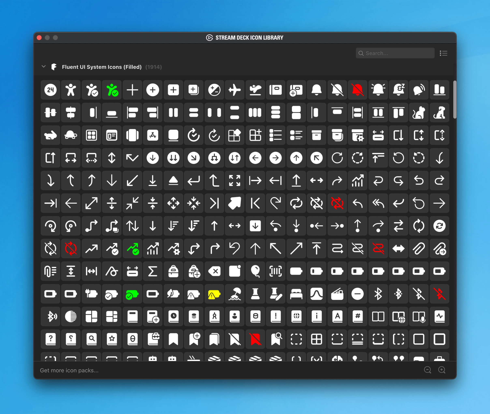
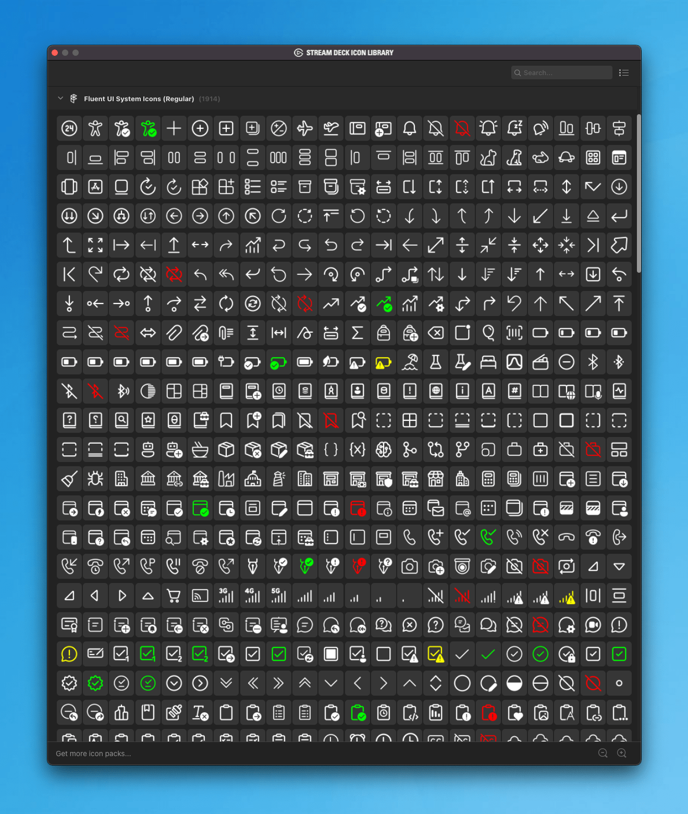

# Stream Deck icon packs: Fluent UI System Icons

These are free icon packs for the [Elgato Stream Deck](https://www.elgato.com/en/stream-deck),
based on both regular and filled variants of Microsoft's
[Fluent UI System Icons](https://github.com/microsoft/fluentui-system-icons).
Thanks, Microsoft!

Each pack consists of 1800+ monochrome icons (PNG, 144×144px). Several of them
come with red/green alternatives.

## Screenshots

### Filled variant

### Regular variant

## How to install

1. Download the `Source code (ZIP)` file of the [latest release](https://github.com/carlo/streamdeck-iconpack-fluentui-system-icons/releases/latest)
2. Extract the downloaded ZIP file. The icon packs are folders contained within, ending in `.sdIconPack`
3. Move `fluentui-system-icons-filled.sdIconPack` and/or `fluentui-system-icons-regular.sdIconPack` into the `IconPacks/` directory in your local SD data folder✱
4. Quit the Stream Deck software and restart it
5. The icon pack(s) should now be available in your Stream Deck Icon Library

✱) On macOS, that's `$HOME/Library/Application Support/com.elgato.StreamDeck/IconPacks`,
on Windows it's probably `C:\Users\you\AppData\Roaming\Elgato\StreamDeck\IconPacks`.

## Why

I like clean, "readable" icons, preferrably on a black background. I'm over 40,
maybe there's a relation, what do I know. `¯\_(ツ)_/¯`

## Authors & License

This repository and the finished icon packs are [MIT licensed](LICENSE.md) by
Carlo Zottmann ([website](https://czm.io), [Github](https://github.com/carlo)).

The original [Fluent UI System Icons](https://github.com/microsoft/fluentui-system-icons)
by Microsoft are released under the
[MIT license](https://github.com/microsoft/fluentui-system-icons/blob/master/LICENSE).
